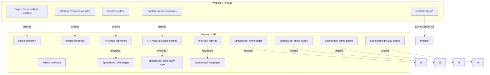

# Collection Audit Report

**Date**: December 17, 2025  
**Auditor**: Agent 1B  
**Scope**: All Payload CMS collections vs. Website frontend usage

---

## Executive Summary

After auditing all 32 collections in the Payload CMS and cross-referencing with the website repository, I've identified a clear architectural pattern:

- **Unified Pages Collection**: The CMS has a `pages` collection that can handle all page types via a `pageType` discriminator
- **Specialized Page Collections**: 13 specialized page collections (HomePage, AboutPage, ContactPage, etc.) that duplicate Pages functionality
- **Content Collections**: 3 content collections (Articles, Videos, HelpArticles) that are actively used
- **API Aliases**: Custom API routes that map clean names (`/api/offers`) to specialized collections (`/api/offer-pages`)
- **Critical Issue**: Website queries a `legal` collection that doesn't exist

---

## Complete Collection Inventory

### Core Collections (8) - **KEEP ALL**

1. **users** - Authentication and user management ✅ Used
2. **roles** - RBAC permissions ✅ Used  
3. **sites** - Multi-site management ✅ Used
4. **site-settings** - Site configuration ✅ Used (website queries this)
5. **languages** - Localization ✅ Used
6. **media** - Asset management ✅ Used
7. **api-keys** - API authentication ✅ Used
8. **translation-queue** - Workflow management ✅ Used internally

### Taxonomy Collections (5) - **KEEP ALL**

9. **article-categories** ✅ Used (referenced by Articles)
10. **case-study-categories** ✅ Used (referenced by CaseStudyPage)
11. **offer-categories** ✅ Used (referenced by OfferPage)
12. **help-categories** ✅ Used (referenced by HelpArticles)
13. **video-categories** ✅ Used (referenced by Videos)

### Content Collections (3) - **KEEP ALL**

14. **articles** ✅ Used (website: `listArticles`, `getArticleBySlug`)
15. **videos** ✅ Used (website: `listVideos`, `getVideoBySlug`)
16. **help-articles** ✅ Used (referenced in HelpArticlePage)

### Unified Page Collection (1) - **KEEP**

17. **pages** ✅ Used (website: `getPageBySlug`, sitemap generation)

### Specialized Page Collections (13) - **REMOVE ALL**

18. **home-pages** ❌ NOT used by website (has API alias `/api/home-pages` but website doesn't query it)
19. **about-pages** ❌ NOT used by website
20. **contact-pages** ❌ NOT used by website  
21. **pricing-pages** ❌ NOT used by website
22. **offer-pages** ⚠️ Has API alias `/api/offers` but website expects different schema
23. **case-study-pages** ⚠️ Has API alias `/api/case-studies` but website expects different schema
24. **article-pages** ❌ NOT used (website uses `articles` collection instead)
25. **help-article-pages** ❌ NOT used (website uses `help-articles` collection instead)
26. **video-pages** ❌ NOT used (website uses `videos` collection instead)
27. **careers-pages** ❌ NOT used by website
28. **faq-pages** ⚠️ Has API alias `/api/faq` but website expects different schema
29. **terms-pages** ❌ NOT used (website expects `legal` collection)
30. **privacy-pages** ❌ NOT used (website expects `legal` collection)

### Navigation & Testimonials (2) - **KEEP**

31. **navigation** ✅ Used (website: `getNavigation`)
32. **testimonials** ✅ Used (website: `listTestimonials`, `getTestimonialBySlug`)

---

## Architecture Analysis

### Current State: Hybrid Architecture with Issues



### The Pages Collection Schema

The `pages` collection supports:

- **pageType field**: Discriminator with values: home, about, contact, pricing, privacy, terms, faq, careers, generic
- **All blocks**: Hero, Features, Pricing, Testimonials, CTA, FAQ, RichText, Media, Articles, CaseStudies, OfferShowcase, Newsletter, etc.
- **Full localization**: All content fields localized
- **SEO fields**: Complete meta tags
- **Workflow fields**: Draft/published status, approval workflow

### What Specialized Collections Offer

Each specialized page collection has:

- **Subset of blocks**: Only specific blocks relevant to that page type
- **Same workflow**: Identical draft/publish/approval system
- **Same SEO**: Identical SEO field structure
- **Same localization**: Same locale handling
- **Additional constraints**: Some have page-specific fields (e.g., ContactPage has contactInfo group, CareersPage has jobListings array)

**Key Finding**: The specialized collections add minimal value. The Pages collection can handle all page types with its flexible block system.

---

## Critical Issues Discovered

### Issue 1: Missing "legal" Collection ⚠️ HIGH PRIORITY

**Problem**: Website queries `/api/legal` but no such collection or API alias exists.

**Evidence**:

```typescript
// website-master-template/src/lib/repository/legal.ts
export const listLegal = async ({ siteKey, locale }) => {
  const result = await payloadFind<CmsLegal>({
    collection: "legal",  // ❌ DOESN'T EXIST
    where,
    depth: 2,
    locale,
  });
  return result.docs;
};
```

**CMS Reality**:

- Has `terms-pages` collection (slug: 'terms-pages')
- Has `privacy-pages` collection (slug: 'privacy-pages')  
- Has `legal` **global** (for settings/URLs, not content)
- **NO** `legal` collection

**Impact**: Legal pages (terms, privacy) cannot be queried by website.

**Solutions**:

1. **Option A**: Create API alias `/api/legal` that combines `terms-pages` and `privacy-pages`
2. **Option B**: Create new `legal` collection and migrate data from terms-pages/privacy-pages
3. **Option C**: Update website to query `terms-pages` and `privacy-pages` separately

### Issue 2: Schema Mismatch for Aliased Collections ⚠️ MEDIUM PRIORITY

**Problem**: API aliases forward to specialized page collections, but website expects different schemas.

**Example - Offers**:

```typescript
// Website expects (from offers.ts):
interface CmsOffer {
  slug: string;
  title: string;
  subtitle?: string;
  short_description?: string;
  description?: string;
  type?: string;
  layout?: CmsPageBlock[];  // Expects blocks
  features?: string[];
  useCases?: string[];
  // ...
}

// CMS provides (from OfferPage.ts):
{
  slug: string;
  title: string;
  category: relationship;  // ❌ Website doesn't expect this
  excerpt?: string;        // ❌ Different field name
  featuredImage?: upload;  // ❌ Website doesn't expect this
  content: blocks[];       // ✅ But website calls it "layout"
  // Missing: subtitle, short_description, description, type, features, useCases
}
```

**Impact**: Website may receive data in unexpected format, causing runtime errors or missing content.

### Issue 3: Duplicate Collections for Same Content Type

**Problem**: Both content collections AND specialized page collections exist for the same content:

- `articles` collection + `article-pages` collection
- `videos` collection + `video-pages` collection  
- `help-articles` collection + `help-article-pages` collection

**Current Usage**:

- Website queries `articles`, `videos`, `help-articles` ✅
- Website does NOT query `article-pages`, `video-pages`, `help-article-pages` ❌

**Impact**: Admin UI clutter, confusion about which collection to use, potential data duplication.

---

## Removal Recommendations

### Phase 1: Remove Unused Specialized Page Collections (8 collections)

**Safe to Remove Immediately** (no API aliases, no usage):

1. `home-pages` - Website uses `pages` collection with `slug: "home"`
2. `about-pages` - Website uses `pages` collection with `slug: "about"`
3. `contact-pages` - Website uses `pages` collection with `slug: "contact"`
4. `pricing-pages` - Website uses `pages` collection with `slug: "pricing"`
5. `article-pages` - Website uses `articles` collection instead
6. `video-pages` - Website uses `videos` collection instead
7. `help-article-pages` - Website uses `help-articles` collection instead
8. `careers-pages` - Website doesn't have careers section

**Files to Delete**:

- `/src/collections/HomePage.ts`
- `/src/collections/AboutPage.ts`
- `/src/collections/ContactPage.ts`
- `/src/collections/PricingPage.ts`
- `/src/collections/ArticlePage.ts`
- `/src/collections/VideoPage.ts`
- `/src/collections/HelpArticlePage.ts`
- `/src/collections/CareersPage.ts`

**Changes to `payload.config.ts`**:

```typescript
// Remove these imports:
- import { HomePage } from '@/collections/HomePage'
- import { AboutPage } from '@/collections/AboutPage'
- import { ContactPage } from '@/collections/ContactPage'
- import { PricingPage } from '@/collections/PricingPage'
- import { ArticlePage } from '@/collections/ArticlePage'
- import { VideoPage } from '@/collections/VideoPage'
- import { HelpArticlePage } from '@/collections/HelpArticlePage'
- import { CareersPage } from '@/collections/CareersPage'

// Remove from collections array:
collections: applyGlobalCollectionHooks([
  // ... other collections ...
  Pages,
-  HomePage,
-  AboutPage,
-  ContactPage,
-  PricingPage,
-  ArticlePage,
-  HelpArticlePage,
-  VideoPage,
-  CareersPage,
  // ... other collections ...
])
```

### Phase 2: Fix Critical Issues (MUST DO BEFORE REMOVING MORE)

#### Fix 1: Resolve "legal" Collection Issue

**Recommended Solution**: Create API alias for legal pages

Create `/src/app/(payload)/api/legal/route.ts`:

```typescript
import { NextRequest, NextResponse } from 'next/server'

/**
 * Alias route: /api/legal -> combines terms-pages and privacy-pages
 * Provides unified legal documents endpoint
 */
export async function GET(request: NextRequest) {
  const url = new URL(request.url)
  const searchParams = url.searchParams.toString()
  
  // Fetch both terms and privacy pages
  const [termsRes, privacyRes] = await Promise.all([
    fetch(`${url.origin}/api/terms-pages${searchParams ? `?${searchParams}` : ''}`, {
      headers: Object.fromEntries(request.headers.entries()),
      cache: 'no-store',
    }),
    fetch(`${url.origin}/api/privacy-pages${searchParams ? `?${searchParams}` : ''}`, {
      headers: Object.fromEntries(request.headers.entries()),
      cache: 'no-store',
    }),
  ])

  const [termsData, privacyData] = await Promise.all([
    termsRes.json(),
    privacyRes.json(),
  ])

  // Combine results
  const combinedDocs = [
    ...(termsData.docs || []),
    ...(privacyData.docs || []),
  ]

  return NextResponse.json({
    docs: combinedDocs,
    totalDocs: combinedDocs.length,
    limit: termsData.limit || 10,
    totalPages: Math.ceil(combinedDocs.length / (termsData.limit || 10)),
    page: termsData.page || 1,
  })
}
```

#### Fix 2: Align Schemas or Update Website

**Option A**: Update website repository to match CMS schemas

**Option B**: Create transformation layer in API aliases

**Option C**: Migrate to content collections (see Phase 3)

### Phase 3: Evaluate Aliased Collections (5 collections)

**Collections with API Aliases** (require decision):

1. `offer-pages` → `/api/offers` alias
2. `case-study-pages` → `/api/case-studies` alias
3. `faq-pages` → `/api/faq` alias
4. `terms-pages` → part of `/api/legal` (proposed)
5. `privacy-pages` → part of `/api/legal` (proposed)

**Decision Required**:

- **Keep as-is**: If specialized page collections provide value (e.g., specific validation, unique fields)
- **Migrate to content collections**: Create `offers`, `case-studies`, `faq`, `legal` collections matching website expectations
- **Migrate to Pages**: Use unified `pages` collection with appropriate `pageType` values

---

## Impact Assessment

### If We Remove Recommended Collections (Phase 1)

**Database Impact**:

- 8 tables removed (one per collection)
- 8 version tables removed (draft tables)
- ~16 locale tables removed (localization tables)
- **Total**: ~32 database tables removed

**Admin UI Impact**:

- 8 fewer collections in sidebar
- Cleaner, more focused admin interface
- Less confusion about which collection to use

**Website Impact**:

- **ZERO** - Website doesn't query these collections
- No code changes needed in website repository

**Content Migration**:

- If any content exists in these collections, it would need to be migrated to `pages` collection
- Migration script needed to:
  1. Export data from specialized collections
  2. Transform to `pages` format with appropriate `pageType`
  3. Import into `pages` collection

### If We Remove Aliased Collections (Phase 3)

**Requires**:

1. Create proper content collections (`offers`, `case-studies`, `faq`, `legal`)
2. Migrate data from specialized page collections
3. Update or remove API aliases
4. Database migration

**Benefits**:

- Cleaner architecture
- Schemas match website expectations
- No transformation layer needed

---

## Recommended Action Plan

### Immediate Actions (Week 1)

1. ✅ **Create `/api/legal` alias** (Fix critical issue)
2. ✅ **Verify website functionality** with current collections
3. ✅ **Document schema mismatches** for aliased collections

### Short-term (Week 2-3)

4. ✅ **Remove Phase 1 collections** (8 unused specialized page collections)
5. ✅ **Run database migration** to drop tables
6. ✅ **Test admin UI** after removal
7. ✅ **Update documentation**

### Medium-term (Month 2)

8. ⚠️ **Decide on Phase 3 collections** (keep specialized or migrate to content)
9. ⚠️ **If migrating**: Create new content collections matching website schemas
10. ⚠️ **If migrating**: Write data migration scripts
11. ⚠️ **If migrating**: Update API aliases or remove them

### Long-term (Month 3+)

12. 📋 **Evaluate Pages collection usage** - Is it being used? Should more pages migrate to it?
13. 📋 **Consider consolidation** - Can we simplify further?
14. 📋 **Performance optimization** - Fewer collections = faster queries

---

## Files to Create/Modify (For Wave 2 Implementation)

### Files to Create:

1. `/src/app/(payload)/api/legal/route.ts` - Legal pages API alias
2. `/docs/COLLECTIONS_MIGRATION.md` - Migration guide (if proceeding with Phase 3)
3. `/scripts/migrate-specialized-to-content.ts` - Data migration script (if proceeding with Phase 3)

### Files to Modify:

1. `/src/payload.config.ts` - Remove collection imports and registrations
2. `/docs/ARCHITECTURE.md` - Update architecture documentation
3. `/README.md` - Update collection inventory

### Files to Delete (Phase 1):

1. `/src/collections/HomePage.ts`
2. `/src/collections/AboutPage.ts`
3. `/src/collections/ContactPage.ts`
4. `/src/collections/PricingPage.ts`
5. `/src/collections/ArticlePage.ts`
6. `/src/collections/VideoPage.ts`
7. `/src/collections/HelpArticlePage.ts`
8. `/src/collections/CareersPage.ts`

### Files to Delete (Phase 3 - if migrating):

9. `/src/collections/OfferPage.ts`
10. `/src/collections/CaseStudyPage.ts`
11. `/src/collections/FAQPage.ts`
12. `/src/collections/TermsPage.ts`
13. `/src/collections/PrivacyPage.ts`
14. `/src/app/(payload)/api/offers/route.ts` (API alias no longer needed)
15. `/src/app/(payload)/api/case-studies/route.ts` (API alias no longer needed)
16. `/src/app/(payload)/api/faq/route.ts` (API alias no longer needed)

---

## Summary Statistics

**Total Collections**: 32

**Breakdown**:

- ✅ **Keep (Essential)**: 19 collections
  - Core: 8
  - Taxonomy: 5
  - Content: 3
  - Pages: 1
  - Navigation/Testimonials: 2

- ❌ **Remove (Phase 1 - Unused)**: 8 collections
  - home-pages, about-pages, contact-pages, pricing-pages
  - article-pages, video-pages, help-article-pages, careers-pages

- ⚠️ **Review (Phase 3 - Aliased)**: 5 collections
  - offer-pages, case-study-pages, faq-pages
  - terms-pages, privacy-pages

**Reduction**: From 32 to 24 collections immediately (-25%)

**Potential Further Reduction**: To 19 collections if Phase 3 executed (-41% total)

---

## Detailed Evidence

### Website Repository Analysis

**Location**: `/Users/carlossalas/Projects/Dev_Sites/templates/website-master-template`

**Collections Queried by Website**:

1. **pages** - `src/lib/repository/pages.ts`
   - `getPageBySlug()` - Used for all page types
   - `getHomepage()` - Queries pages with slug "home"
   - Used in `src/app/sitemap.ts`

2. **articles** - `src/lib/repository/articles.ts`
   - `listArticles()` - Lists all articles
   - `getArticleBySlug()` - Gets single article
   - Used in `src/app/sitemap.ts`

3. **videos** - `src/lib/repository/videos.ts`
   - `listVideos()` - Lists all videos
   - `getVideoBySlug()` - Gets single video
   - Used in `src/app/sitemap.ts`

4. **case-studies** - `src/lib/repository/caseStudies.ts`
   - `listCaseStudies()` - Lists all case studies
   - `getCaseStudyBySlug()` - Gets single case study
   - Used in `src/app/sitemap.ts`
   - **Note**: Queries `case-studies` but CMS has `case-study-pages` (API alias exists)

5. **offers** - `src/lib/repository/offers.ts`
   - `listOffers()` - Lists all offers
   - `getOfferBySlug()` - Gets single offer
   - Used in `src/app/sitemap.ts`
   - **Note**: Queries `offers` but CMS has `offer-pages` (API alias exists)

6. **faq** - `src/lib/repository/faq.ts`
   - `listFaq()` - Lists all FAQ items
   - **Note**: Queries `faq` but CMS has `faq-pages` (API alias exists)

7. **legal** - `src/lib/repository/legal.ts`
   - `listLegal()` - Lists all legal documents
   - `getLegalBySlug()` - Gets single legal document
   - Used in `src/app/sitemap.ts`
   - **Note**: Queries `legal` but NO such collection exists (❌ BROKEN)

8. **navigation** - `src/lib/repository/navigation.ts`
   - `getNavigation()` - Gets navigation items

9. **testimonials** - `src/lib/repository/testimonials.ts`
   - `listTestimonials()` - Lists testimonials
   - `getTestimonialBySlug()` - Gets single testimonial

10. **site-settings** - `src/lib/repository/siteSettings.ts`
    - `getSiteSettings()` - Gets site configuration

### API Aliases Discovered

**Location**: `/Users/carlossalas/Projects/Dev_Sites/cms/payload-cms/src/app/(payload)/api/`

1. **`/api/offers/route.ts`** → forwards to `/api/offer-pages`
2. **`/api/case-studies/route.ts`** → forwards to `/api/case-study-pages`
3. **`/api/faq/route.ts`** → forwards to `/api/faq-pages`

**Missing Alias**:
- **`/api/legal`** → NO ALIAS EXISTS (should combine terms-pages + privacy-pages)

### Collections NOT Queried by Website

**Specialized Page Collections** (completely unused):
- `home-pages` - Has slug but website uses `pages` collection
- `about-pages` - Has slug but website uses `pages` collection
- `contact-pages` - Has slug but website uses `pages` collection
- `pricing-pages` - Has slug but website uses `pages` collection
- `article-pages` - Website uses `articles` collection instead
- `video-pages` - Website uses `videos` collection instead
- `help-article-pages` - Website uses `help-articles` collection instead
- `careers-pages` - Website has no careers section

**Evidence**: Searched entire website repository for collection names:
```bash
# No matches found for:
grep -r "home-pages" website-master-template/src/
grep -r "about-pages" website-master-template/src/
grep -r "contact-pages" website-master-template/src/
grep -r "pricing-pages" website-master-template/src/
grep -r "article-pages" website-master-template/src/
grep -r "video-pages" website-master-template/src/
grep -r "help-article-pages" website-master-template/src/
grep -r "careers-pages" website-master-template/src/
```

---

## Conclusion

The audit reveals a **hybrid architecture with technical debt**:

1. **Good**: Unified `pages` collection exists and is being used
2. **Good**: Content collections (`articles`, `videos`, `help-articles`) are properly separated and used
3. **Bad**: 8 specialized page collections are completely unused
4. **Bad**: 5 specialized page collections have API aliases but schema mismatches
5. **Critical**: Website queries non-existent `legal` collection

**Recommended Path Forward**:

1. Fix critical `legal` collection issue immediately
2. Remove 8 unused specialized page collections (safe, no impact)
3. Evaluate whether to keep or migrate the 5 aliased collections based on business needs

This cleanup will result in a cleaner admin UI, less confusion, better maintainability, and a more consistent architecture.

---

**End of Audit Report**
