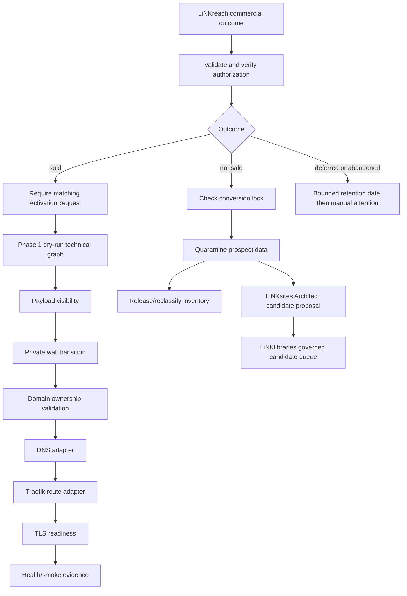

# W2-06 Phase 1 lifecycle boundary

This document records the source-level, local-test boundary for commercial outcomes. It is not proof of a real sale, Cloudflare change, domain cutover, VPS route, Payload publication, or TLS certificate.

## Authority and state flow



## Controls proved locally

- The authenticated orchestrator ingress accepts only a W2-05 HMAC/key-id/freshness/nonce/event-grant verified pending event. It turns that verifier result into a one-request scoped outcome authorization before lifecycle persistence; a caller cannot supply an authorization marker. A `CommercialOutcomeEnvelope` is schema-validated and deduplicated by immutable event ID. A duplicate with changed commercial facts is rejected.
- A sold outcome alone cannot activate anything. A matching `ActivationRequest` and separate LiNKreach authorization are both required.
- The only shipped activation providers are dry-run providers. Every receipt states `mode: dry_run` and `publicMutation: false`; the graph records Payload, private-wall, domain, DNS, route, TLS, and health steps plus compensation receipts if a step fails.
- No-sale recycling checks the conversion lock before it touches prospect content. It then records quarantine and inventory-release receipts; a locked foundation is not quarantined or released.
- Deferred and abandoned records receive a single explicit retention deadline. When it expires, the record moves to manual attention with `automaticRetry: false`.
- The LiNKsites Architect removes prospect/customer fields and supplied lead values, requires source runs/evidence, passing tests, license/provenance and compatibility, and submits only a `candidate` to a queue-only LiNKlibraries interface. It cannot approve, overwrite, select, or publish a canonical library asset.

## Redacted recycling trace

```json
{
  "outcome": "no_sale",
  "authorization": "verified",
  "conversionLock": "absent",
  "content": "quarantined without lead data in the receipt",
  "inventory": "released",
  "publicMutation": false
}
```

## Candidate manifest shape

```json
{
  "status": "candidate",
  "sourceRunIds": ["run-001"],
  "sourceEvidenceReferences": ["evidence://run-001"],
  "kind": "layout",
  "versionIntent": "new_variant",
  "compatibility": { "nodeMajor": 22, "runtimes": ["node", "browser"] },
  "license": { "spdx": "MIT", "redistributionAllowed": true, "provenance": "source-run-001" },
  "tests": [{ "command": "pnpm test", "passed": true }],
  "privacyReview": { "passed": true }
}
```

## Reserved for Phase 2

The following capabilities are deliberately not implemented or invoked by W2-06: real Payload public visibility changes, private-wall removal, domain ownership challenges, Cloudflare/provider DNS writes, Traefik route activation, TLS issuance, public hosting activation, and any live LiNKlibraries approval or catalog mutation. Each requires separately authorized live credentials and operational approval.
